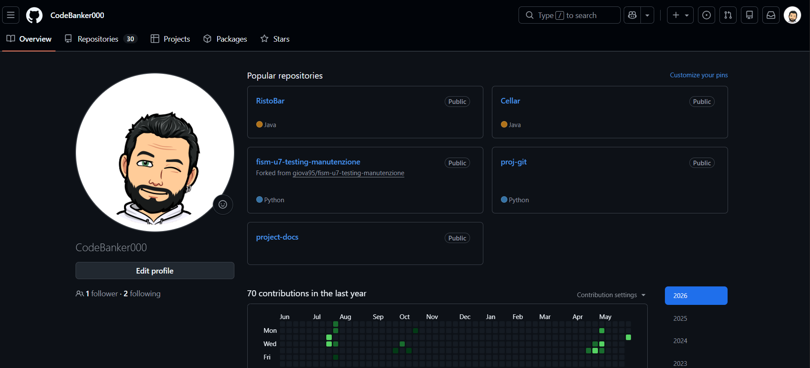

# Project Docs

## Descrizione

## Obbiettivo

## Funzionalità principali

## Requisiti

## Documentazione

- [Installazione](docs/installazione.md)
- [Guida utente](docs/guida-utente.md)
- [FAQ](docs/faq.md)
- [Troubleshooting](docs/troubleshotting.md)

## Installazione

## Utilizzo

## Esempi

## Screenshots

## Struttura del progetto

| Percorso | Descrizione |
| --- | --- |
| `docs/` | Documentazione del progetto |
| `src/` | Codice sorgente |
| `assets/immagini` | Immaginie screenshot |

## Autori

## Licenza
